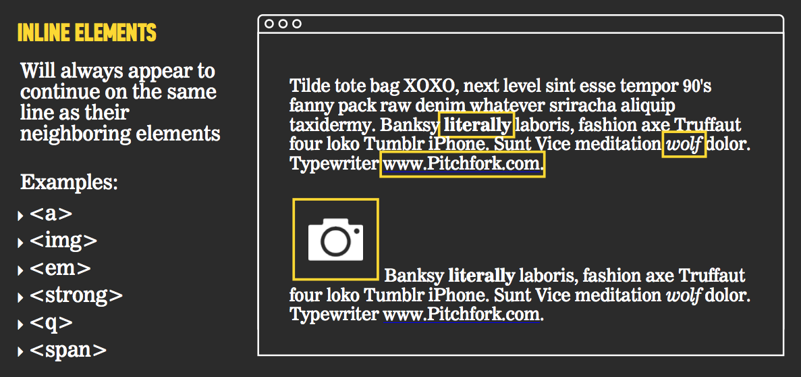
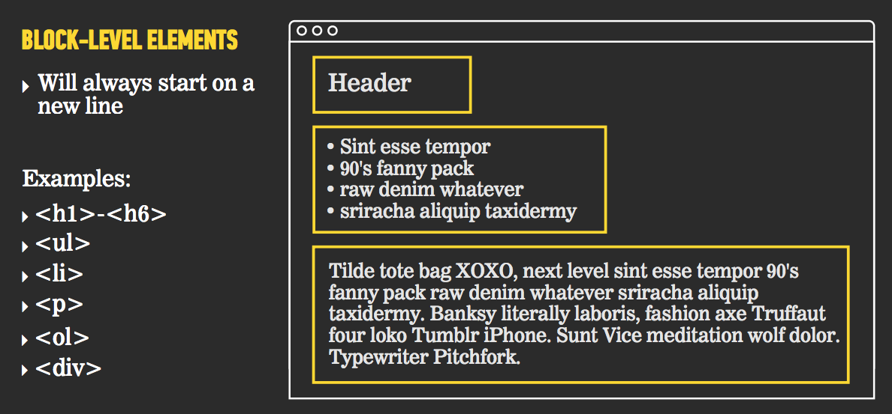
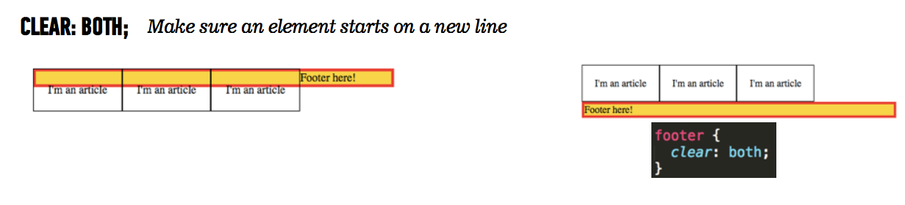

# Front End Web Development (FEWD)
## Lesson 4: CSS LAB

### Review:

Last week we covered:

- Display inline, block, inline-block
- Floats
- Clears
**(Some of the most difficult and confusing parts of CSS)**

#### Inline:



Any element can be made to display like an Inline element if you add:

```CSS
img {
  display: inline;
}
```


#### Block:



Any element can be made to display like a Block element if you add:

```CSS
img {
  display: block;
}
```

#### Inline-block:

A combination of the above. Overflow will be displayed below.

```CSS
img {
  display: inline-block
}
```

#### Floats
Floats 'detach' an element from its normal spot in the HTML structure, and allows it to 'float' around other elments, or up inline with the element above if there is room.

It is used for creating columns, or just putting an image next to some text.


#### Clears

Used for footers often, or anything with a float element above it, that you want to 'clear' below.


### Lab:

Let's recreate another site.


