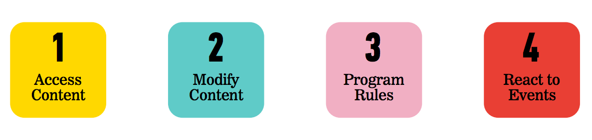

# Pseudo Code and JavaScript

### Objectives
*After this lab, students will be able to:*

- Write Pseudo Code to solve a simple problem
- Describe event-based web site behavior and list practical uses of JavaScript on a website's front end.
- Read JavaScript code and understand what is happening

### Why do we care?

- Pseduo Code allows us to think through problems without worrying about syntax

## Activity
  1. Find a new partner. Someone you haven't yet worked with!
  2. Identify one person to DRAW and one person to TALK.
  3. The person TALKING chooses a shape or object (circle, star, heart, slice of
  pizza, motorcycle etc).
  4. Using explicit step-by-step directions, the talker must get their partner to draw
  the correct shape without ever stating what that shape is.
  5. The person drawing must follow directions exactly, and may not draw anything
  that their partner did not say exactly.

## Programming
WHAT IS A PROGRAM?
  - A program is a set of instructions that you write to tell a computer what to do
  - Metaphor: a recipe
WHAT IS PROGRAMMING?
  - Programming is the task of writing those instructions in a language that the computer can understand.
  - It's more about learning how to think programmatically than it is about learning the syntax of a particular language

HOW COMPUTERS 'THINK'
 - Short answer — they don’t think! (Accept AI). The browser does not think.
 - While browsers don’t think, they act as if they do, by sequentially executing simple instructions.
 - The only things a browser knows are the things we tell it.
 - A browser doesn't learn to perform tasks like you and I — it needs to follow instructions every time it performs the task.

## PSEUDO CODE
  - When we write a program, we need to figure out a way to translate the ideas that are in our heads into code
  - Pseudo code is a way to 'plan out' your program before coding it
  - Pseudo code is a detailed yet readable description of what a computer program must do
  - Expressed in plain english rather than in a programming language

### Examples
  - Height comparison - pseudo code that tells us which of two objects is taller
  - Passing score - pseudo code that tells us if a score is high enough to pass

## Activity
- Find a new partner
- Write pseudo code for an application that would monitor the room temperature and adjust it so the room remains at a certain temperature.

## Activity
- Find a new partner
- Divide partners into two groups
- Half of you will pseudo code Rock Paper Scissors

- Half of you will pseudo code the following:
  1. Image we have a simple webpage with a button, a ring,
  and Frodo.
  2. Every time users click on the button, the Ring of Power
  gets put on Frodo’s finger, which makes Frodo disappear.
  If users click on the button again, the Ring of Power gets
  taken off of Frodo’s finger, and Frodo reappears.

## What is JavaScript
- HTML = Noun
- CSS = Adjective
- Javascript = Verb

**Just a quick note! We're learning JavaScript in this class, not Java.
Java and JavaScript are actually two different languages.**

### What is the DOM?
- The browser pulls in this HTML document, analyzes it, and creates an object model of the page
in memory.
- This model is called the Document Object Model (DOM).
- The DOM is structured like a tree, a DOM Tree, like we talked about early in the course.
- CSS is then applied
- Then JavaScript functions are run

- Each element in the HTML document is represented by a DOM node.
- You can think of a node as a live object that you can access and change using JavaScript.
- When the model is updated, those changes are reflected on screen.

### What JavaScript can do with the DOM:

#### Accessing Content
For example:
- Find out what the user entered into a text input when they submit a form
- Find out whether the user checked a checkbox
- Select the element that has the id attribute with a value of email

#### Modify Content
For example:
- Add an error message below a form
- Change the size, position, color, or other styles for an element
- Add or remove a class from elements to trigger new CSS rules for those elements

#### Program Rules
For example:
- Have images/text fade in as the user scrolls down the page
- Check to make sure the user has entered a valid email address into a form and display an error message if not
- Open a chat panel when the user clicks on a 'Chat with Us' button
- Filter data when the user selects a filter

#### React to Events
For example:
- When a button is clicked
- When the cursor hovers over an element
- When the user types information into a form
- When a page has finished loading
- When the user hits enter to submit a form

## Reading JavaScript
Example: [Color Scheme Switcher](http://codepen.io/nevan/pen/kBItz)

### Exercise
- Find a new partner
- Take a look at the [Traffic Light code in Codepen](http://codepen.io/nevan/pen/shtLA)
- The yellow button changes the bulb to purple and the green light does not work
- Make some minor changes to the code so that the traffic light works correctly.

### Conclusion: Q & A
